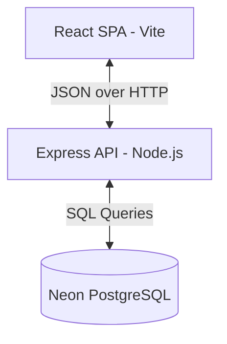

# ApexInventory | Inventory & Order Management System

A high-performance, responsive inventory catalog and order management system built with a **React** (Vite) single-page application, an **Express.js** API backend, and a **Neon-hosted PostgreSQL** database.

## System Architecture



### Monorepo Structure
- `client/`: Vite-configured React frontend utilizing Vanilla CSS variables for glassmorphism, transitions, and native layout responsive grid systems.
- `server/`: Node.js & Express server with clean, modular routing for authentication, product catalogs, order pipelines, and dashboard telemetry.

---

## PostgreSQL Schema & Precision Design Choices

To support large quantities, precise pricing, and complex scaling units, the database fields use PostgreSQL's native **`NUMERIC`** type instead of standard floating-point approximations:

```sql
-- Decimal precision definitions
quantity NUMERIC(20, 4) DEFAULT 0.0000;
price NUMERIC(20, 4) DEFAULT 0.0000;
subtotal NUMERIC(20, 4) DEFAULT 0.0000;
```

### Why Numeric?
1. **Financial Accuracy**: JavaScript and databases representing money using floating-point types (`float` / `double`) suffer from rounding errors due to IEEE 754 representation (e.g., `0.1 + 0.2 === 0.30000000000000004`). By utilizing `NUMERIC(20, 4)` in PostgreSQL, all price fields and invoice totals are calculated exactly.
2. **High Decimal Quantities**: When handling raw bulk commodities such as `Basmati Rice` in Kilograms (`kg`) or `Coconut Oil` in Liters (`L`), orders are often placed in fractional quantities (e.g., `0.0050 kg` of saffron or saffron extract). The database preserves this detail up to 4 decimal places.
3. **Automatic Unit Conversion**: The order system allows ordering products in compatible units (e.g., ordering grams of a product stocked in kilograms). The backend safely performs mathematical scaling (`1 kg = 1000 g` and vice versa) and stores the exact precision values.

---

## Local Setup & Run Instructions

### Prerequisites
- Node.js (v18+)
- A Neon PostgreSQL Connection URI

### Step 1: Clone and Install Dependencies
Install all package dependencies for the client, server, and workspace:
```bash
npm run install:all
```

### Step 2: Database Setup
1. Create a free project at [Neon.tech](https://neon.tech/).
2. Copy the connection string (`postgresql://neondb_owner:...`).
3. Set your configuration environment by creating a `server/.env` file:
   ```env
   PORT=5005
   DATABASE_URL=your_neon_connection_string
   JWT_SECRET=super_secret_inventory_key_123
   NODE_ENV=development
   ```
4. Run the automated database creation and seeding script:
   ```bash
   npm run seed
   ```
   *This seeds default accounts: Admin (`admin@inventory.com`) and Seller (`seller@inventory.com`) with the password `password123`.*

### Step 3: Run the Application
Start both the React development server and the Express API server concurrently:
```bash
npm run dev
```

The frontend will run at `http://localhost:5173` and the API will listen on `http://localhost:5005`.

---

## Features
- **Dual Role Authorization**:
  - **Admin**: Full database CRUD permissions, catalog controls, price updates, global statistics dashboard, and order state overrides.
  - **Seller**: Search inventory, adjust/refill stock levels, check low-stock thresholds, and submit customer invoice orders or quotation estimates.
- **Dynamic Conversion Matrix**: Automates conversions between weight metrics (`kg` and `g`) and volume metrics (`L` and `mL`).
- **Interactive Metrics Dashboard**: Tracks real-time revenue, low stock counts, and generates weekly sales progress telemetry.
- **Custom UI Styling**: Pure Vanilla CSS offering responsive layouts, backdrop blurs, glow transitions, and responsive grid alignment.
